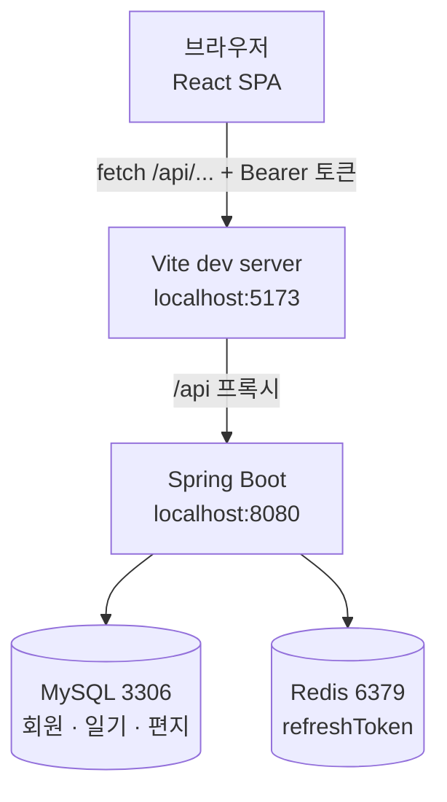
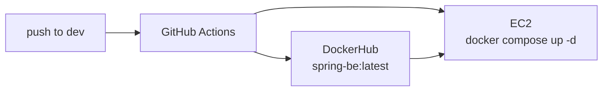

# EmoLetter

> 하루의 감정을 달력에 기록하고, 미래의 나에게 편지를 보내는 서비스


---

## 목차

- [핵심 아이디어](#핵심-아이디어)
- [주요 기능](#주요-기능)
- [기술 스택](#기술-스택)
- [시스템 구성](#시스템-구성)
- [시작하기](#시작하기)
- [화면 소개](#화면-소개)
- [프로젝트 구조](#프로젝트-구조)
- [API 명세](#api-명세)
- [알려진 이슈](#알려진-이슈)
- [배포](#배포)

---

## 핵심 아이디어

- 사용자가 매일 감정을 기록하고 메모(일기)를 작성
- 미래의 나에게 편지를 써서 지정한 날짜에 확인 가능
- (선택) 작성된 감정들을 통계/차트로 확인 가능
- (선택) 친구끼리 일기 공유/편지 보내기

### 필요 이유

- 바쁜 일상 속에서 **자신의 감정을 돌아보고 정리할 수 있는 공간**을 제공하기 위해
- 단순한 일기장을 넘어, **미래의 나와 소통할 수 있는 특별한 경험**을 만들기 위해
- 감정을 시각화하여 **스스로를 더 잘 이해하고 성장할 수 있도록** 돕기 위해

---

## 주요 기능

### 감정 일기

날짜마다 감정 하나와 글을 남기면 달력 칸에 해당 이모지가 표시된다. 같은 날짜에 다시 쓰면
기존 내용이 채워진 채로 열리고, 저장 시 자동으로 수정 처리된다.

| code | 이모지 | 라벨 | code | 이모지 | 라벨 |
|---|:---:|---|---|:---:|---|
| `HAPPY` | 😊 | 행복 | `EXCITED` | 🤩 | 신남 |
| `SAD` | 😢 | 슬픔 | `CALM` | 😌 | 평온 |
| `ANGRY` | 😠 | 화남 | `LOVE` | 🥰 | 사랑 |
| `ANXIOUS` | 😰 | 불안 | `TIRED` | 😴 | 피곤 |

`emojiCode`는 DB에서 자유 문자열 컬럼이라 감정을 추가해도 스키마 변경이 필요 없다.

### 타임캡슐 편지

받을 날짜를 지정해 편지를 쓰면, 그 날짜가 지나야 열어볼 수 있다.
아직 도착하지 않은 편지는 목록에서 본문이 가려진다.

편지는 두 가지 상태 플래그를 가진다.

| 플래그 | 의미 | 갱신 시점 |
|---|---|---|
| `isDelivered` | 받을 날짜가 지나 열람 가능해졌는가 | 백엔드 스케줄러가 매분 갱신 |
| `isOpened` | 사용자가 실제로 열어봤는가 | 상세 조회 API 호출 시 |

편지에는 제목(`title`)과 편지지(`noteCode`)가 있다. 편지지는 `PINK` · `PURPLE` · `MINT` · `CREAM` 네 종류다.
`title`은 2026.08.27에 추가돼 nullable이며, 그 전에 쓴 편지는 목록에서 본문 앞 40자를 제목 자리에 보여준다.

### 인증

JWT 기반. 로그인하면 `accessToken`은 응답 본문으로, `refreshToken`은 `httpOnly` 쿠키로 내려온다.
프론트는 `accessToken`만 `localStorage`에 보관하고 모든 요청에 `Authorization: Bearer`로 붙인다.
새로고침하면 저장된 토큰으로 `GET /api/user`를 호출해 세션을 복구한다.

accessToken이 만료돼 401이 오면 `POST /api/token`으로 재발급을 한 번 시도하고 원래 요청을 재시도한다.
여러 요청이 동시에 401을 받아도 재발급은 한 번만 일어나도록 진행 중인 Promise를 공유한다.
재발급까지 실패했을 때만 세션을 정리한다.

### 오류 응답 규칙

응답에는 사용자가 읽을 문장만 담고, 원인과 조치 방법은 서버 콘솔에만 남긴다.

| 상황 | 상태 | 사용자가 보는 문구 |
|---|:---:|---|
| Redis·DB 장애 | 503 | 서버에 일시적인 문제가 발생했습니다. 잠시 후 다시 시도해주세요. |
| 로그인 실패 | 401 | 아이디 또는 비밀번호가 올바르지 않습니다. |
| 토큰 검증 실패 | 401 | 다시 로그인해주세요. |
| 잘못된 입력 | 400 | 요청을 처리할 수 없습니다. 입력값을 확인해주세요. |
| 그 외 | 500 | 서버에 문제가 발생했습니다. 잠시 후 다시 시도해주세요. |

아이디가 없을 때와 비밀번호가 틀릴 때 **같은 문구**를 내보낸다. 다르게 응답하면
아이디 존재 여부를 외부에서 알아낼 수 있기 때문이다. 어느 쪽이었는지는 콘솔 로그에만 남는다.

---

## 기술 스택

| 영역 | 사용 기술 |
|---|---|
| Frontend | React 19, Vite 6, Tailwind CSS 3, Context API |
| Backend | Spring Boot 3.2, Spring Security, Spring Data JPA, JWT |
| Database | MySQL 8.0 (회원·일기·편지), Redis (refreshToken, TTL 24h) |
| Infra | Docker, GitHub Actions, DockerHub, AWS EC2 |

### 도메인 모델

| 엔티티 | 주요 필드 | 비고 |
|---|---|---|
| `User` | `userId`(PK, String), `email`, `nickname`, `password`, `role`, `createAt` | PK가 사용자가 정한 아이디 문자열. 비밀번호는 BCrypt |
| `Diary` | `diaryId`, `content`, `emojiCode`, `createAt`, `user` | `User`와 N:1 |
| `Letter` | `letterId`, `title`, `content`, `noteCode`, `deliverDate`, `isDelivered`, `isOpened`, `createAt`, `user` | `title`은 2026.08.27 추가, nullable |
| `RefreshToken` | `userId`(key), `refreshToken` | Redis 저장, TTL 24시간 |

---

## 시스템 구성



브라우저는 항상 5173만 바라보고 8080을 직접 호출하지 않는다.

**왜 프록시를 쓰는가** — 브라우저가 5173에서 8080을 직접 부르면 오리진이 달라 CORS 예비 요청이 필요하고,
`refreshToken` 쿠키가 `httpOnly` + 크로스 오리진이라 전송 조건이 까다로워진다.
프록시를 두면 브라우저 입장에서는 전부 같은 오리진이라 두 문제가 동시에 사라진다.

```js
// EmoLetter_FE/vite.config.js
server: {
  proxy: {
    '/api': { target: backendOrigin, changeOrigin: true },
  },
}
```

프록시 없이 직접 호출하는 경우를 대비해 백엔드에도 CORS 설정이 있다
(`WebSecurityConfig.corsConfigurationSource`).

---

## 시작하기

### 사전 준비

- JDK 21
- Node.js 18 이상
- MySQL 8.0 (3306)
- Redis (6379)

### 1. 데이터베이스 준비

`.env`의 `DATABASE_DB` 이름으로 된 데이터베이스를 만든다. 테이블은 `ddl-auto: update`가 첫 실행에 생성한다.

```sql
CREATE DATABASE IF NOT EXISTS <DATABASE_DB> DEFAULT CHARACTER SET utf8mb4;
```

### 2. Redis 실행

WSL을 쓴다면 서비스로 등록해두는 편이 편하다. WSL이 뜰 때마다 자동으로 시작된다.

```bash
wsl -d Ubuntu-22.04 -u root -- systemctl enable --now redis-server
```

한 번만 띄우려면 WSL 안에서 직접 실행해도 된다.

```bash
redis-server --bind 0.0.0.0 --protected-mode no --daemonize yes --dir /tmp --pidfile /tmp/redis.pid
```

`redis-cli ping`이 `PONG`을 내면 성공이다.

### 3. 백엔드 실행

`EmoLetter_BE/.env`에 아래 값이 필요하다.

```
DATABASE_DB=          DATABASE_USERNAME=      DATABASE_PASSWORD=
JWT_ISSUER=           JWT_SECRETKEY=
```

IntelliJ에서는 `EmoLetter BE (local)` 실행 구성을 사용한다.
터미널을 선호하면 `.env`를 읽어 그대로 띄우는 스크립트가 있다.

```powershell
cd EmoLetter_BE
.\run-local.ps1
```

> [!IMPORTANT]
> `build.gradle`에 dotenv 의존성이 없어 스프링은 `.env`를 스스로 읽지 못한다.
> IntelliJ 실행 구성은 `envFilePaths`로, `run-local.ps1`은 직접 파싱해 환경변수로 주입한다.
> 이 과정을 건너뛰면 `${DATABASE_DB}`가 빈 값이 되어 기동에 실패한다.

### 4. 프론트엔드 실행

```bash
cd EmoLetter_FE
npm install
npm run dev          # http://localhost:5173
```

백엔드 주소를 바꾸려면 `.env.example`을 `.env`로 복사해 `VITE_BACKEND_ORIGIN`을 수정한다.

---

## 화면 소개

| 화면 | 경로 | 설명 | 호출 API |
|---|---|---|---|
| 랜딩 | `landing/Landing.jsx` | 전체 화면 인트로. 클릭 또는 Enter로 진입 | — |
| 달력 | `calendar/CalendarPage.jsx` | 6주 × 7일 그리드. 일기 쓴 날에 감정 이모지 표시 | `GET /api/diary` |
| 일기 작성 | `diary/DiaryWritePage.jsx` | 감정 8종 선택 + 본문. 기존 일기가 있으면 수정 모드 | `POST` / `PUT /api/diary` |
| 편지 작성 | `letter/LetterWritePage.jsx` | 받을 날짜 · 제목 · 편지지 · 본문. 과거 날짜 선택 불가 | `POST /api/letter` |
| 보낸 편지함 | `letter/SentLettersPage.jsx` | 전체 / 읽은 / 읽지 않은 필터 | `GET /api/letter?isOpened=` |
| 받은 편지함 | `letter/ReceivedLettersPage.jsx` | 도착한 편지만 필터링. 열면 읽음 처리 | `GET /api/letter/{id}` |
| 마이페이지 | `mypage/MyPage.jsx` | 프로필 + 일기·편지 통계, 닉네임 변경 | `GET` / `PUT /api/user` |
| 로그인 모달 | `auth/LoginModal.jsx` | 탭으로 로그인·회원가입 전환. 가입 후 자동 로그인 | `POST /api/user`, `/user/login` |

라우터 라이브러리 대신 `currentView` 상태 하나로 화면을 전환하며, 분기는 `ViewRouter`가 담당한다.
일기 작성 · 편지 작성 · 두 편지함은 로그인이 필요하다.

---

## 프로젝트 구조

```
EmoLetterProject/
├─ EmoLetter_FE/          React 프론트엔드
├─ EmoLetter_BE/          Spring Boot API 서버
└─ .github/workflows/     EC2 배포 파이프라인
```

### 프론트엔드 레이어 규칙

**컴포넌트는 서버를 직접 부르지 않는다.** 데이터는 항상 아래 순서로만 흐른다.

```
components/  →  contexts/  →  api/  →  http.js  →  백엔드
```

| 레이어 | 책임 | 해서는 안 되는 일 |
|---|---|---|
| `components/` | 화면 조립, 입력 검증, 로컬 UI 상태 | `fetch` 직접 호출 |
| `contexts/` | 전역 상태, API 호출 시점 결정, 로딩·에러 | Tailwind 클래스, JSX 마크업 |
| `api/` | 엔드포인트 경로, 요청 조립, 응답 변환 | React 훅 사용 |
| `utils/` `constants/` | 날짜 포맷, 도착 판정, 코드표 | 상태 보유 |

<details>
<summary><b>프론트엔드 파일 트리 (63개 파일, 2,272줄)</b></summary>

```
src/
├─ App.jsx                       16   프로바이더 3중첩만
├─ api/
│  ├─ http.js                    121  fetch 래퍼 · 토큰 · 에러 변환
│  ├─ authApi.js                 34
│  ├─ diaryApi.js                36
│  └─ letterApi.js               48
├─ contexts/
│  ├─ AuthContext.jsx            102  로그인 · 세션 복구 · 401 처리
│  ├─ DiaryContext.jsx           81   날짜 키 색인
│  └─ LetterContext.jsx          83   보낸/받은 편지 파생
├─ hooks/
│  ├─ useAppNavigation.js        56   화면 전환 상태 기계
│  ├─ useLetterReader.js         38   편지 열람 + 모달
│  └─ useClickOutside.js         17
├─ utils/          date.js 44 · letter.js 8
├─ constants/      emotions.js 24 · notes.js 15 · views.js 15
└─ components/
   ├─ common/      Button · Card · Modal · TextField · FilterTabs
   │               PageHeader · StatusMessage · AuthRequired
   │               BackButton · GradientHeading · icons/
   ├─ layout/      AppLayout · Header · HeaderMenu · HomeButton
   │               AuthActions · ViewRouter
   ├─ landing/     Landing
   ├─ calendar/    CalendarPage · CalendarNav · CalendarGrid
   │               CalendarCell · WeekdayRow · buildCalendarDays.js
   ├─ diary/       DiaryWritePage · EmotionPicker
   ├─ letter/      LetterWritePage · SentLettersPage · ReceivedLettersPage
   │               LetterList · LetterCard · LetterStatusBadge
   │               LetterDetailModal · NotePicker
   ├─ auth/        LoginModal · AuthTabs · LoginFields · SignupFields
   │               useAuthForm.js · authValidation.js
   └─ mypage/      MyPage · ProfileSummary · StatCard · NicknameForm
```

</details>

### 공용 컴포넌트

| 컴포넌트 | 역할 | 주요 props |
|---|---|---|
| `Button` | 그라데이션 버튼 | `variant` (pink·purple·gradient·neutral), `size`, `disabled` |
| `Card` | 반투명 흰 패널 | `className` |
| `Modal` | 배경 클릭 시 닫히는 오버레이 | `isOpen`, `onClose` |
| `TextField` | 라벨·에러 포함 입력 | `label`, `error`, `tone` |
| `FilterTabs` | 건수 뱃지 달린 탭 | `options[{value,label,count}]`, `tone` |
| `StatusMessage` | 로딩·빈 상태·에러 3종 | `onRetry` |
| `AuthRequired` | 로그인 필요 안내 | `message`, `onLoginClick` |
| `PageHeader` | 제목 + 부제 | `title`, `subtitle` |

---

## API 명세

모든 경로는 `/api`로 시작한다. 인증이 필요한 요청에는 `Authorization: Bearer <accessToken>` 헤더가 붙는다.

### 인증 · 회원

| 메서드 | 경로 | 설명 | 인증 |
|---|---|---|:---:|
| `POST` | `/api/user` | 회원가입 | — |
| `POST` | `/api/user/login` | 로그인. accessToken 반환 + refreshToken 쿠키 | — |
| `DELETE` | `/api/user/logout` | refreshToken 삭제 및 쿠키 만료 | — |
| `GET` | `/api/user` | 내 정보 조회 | 🔒 |
| `PUT` | `/api/user/info` | 닉네임 수정 | 🔒 |
| `PUT` | `/api/user/info/password` | 비밀번호 변경 | 🔒 |
| `DELETE` | `/api/user` | 회원 탈퇴 | 🔒 |
| `POST` | `/api/token` | accessToken 재발급 | — |
| `GET` | `/api/health` | 헬스체크 | — |

### 일기

| 메서드 | 경로 | 설명 | 인증 |
|---|---|---|:---:|
| `POST` | `/api/diary` | 일기 작성 (201) | 🔒 |
| `GET` | `/api/diary` | 내 일기 전체 조회 | 🔒 |
| `GET` | `/api/diary/{diaryId}` | 일기 단건 조회 | 🔒 |
| `PUT` | `/api/diary/{diaryId}` | 일기 수정 | 🔒 |
| `DELETE` | `/api/diary/{diaryId}` | 일기 삭제 | 🔒 |

### 편지

| 메서드 | 경로 | 설명 | 인증 |
|---|---|---|:---:|
| `POST` | `/api/letter` | 편지 작성 (201) | 🔒 |
| `GET` | `/api/letter?isOpened=` | 내 편지 목록. 파라미터 **필수** | 🔒 |
| `GET` | `/api/letter/{letterId}` | 상세 조회 **+ 읽음 처리** | 🔒 |
| `GET` | `/api/letter/notification` | 도착했지만 안 읽은 편지 | 🔒 |
| `PUT` | `/api/letter/{letterId}` | 편지 수정 | 🔒 |
| `DELETE` | `/api/letter/{letterId}` | 편지 삭제 | 🔒 |

<details>
<summary><b>요청 · 응답 예시</b></summary>

**POST `/api/user/login`**

```json
{ "userId": "testuser1", "password": "test1234" }
```

```json
{
  "userId": "testuser1",
  "nickName": "테스트유저",
  "role": "ROLE_USER",
  "email": "testuser1@example.com",
  "createAt": "2026-08-22T02:31:05",
  "accessToken": "eyJhbGciOiJIUzI1NiJ9…"
}
```

`nickName`의 N이 대문자다. 프론트는 `toUser`에서 `nickname`으로 변환한다.

**POST `/api/diary`**

```json
{
  "content": "연동 테스트 일기입니다.",
  "emojiCode": "HAPPY",
  "createAt": "2026-08-15T00:00:00"
}
```

**GET `/api/diary`**

```json
[
  {
    "diaryId": 1,
    "content": "연동 테스트 일기입니다.",
    "createAt": "2026-08-15T00:00:00",
    "nickname": "테스트유저",
    "emojiCode": "HAPPY"
  }
]
```

**POST `/api/letter`**

```json
{
  "title": "스무 살의 나에게",
  "content": "미래의 나에게. 잘 지내고 있니?",
  "noteCode": "PINK",
  "deliverDate": "2026-12-25T00:00:00"
}
```

**GET `/api/letter/3`** — 호출과 동시에 `isOpened`가 `true`로 바뀐다.

```json
{
  "letterId": 3,
  "title": "스무 살의 나에게",
  "content": "미래의 나에게. 잘 지내고 있니?",
  "deliverDate": "2026-08-22T00:00:00",
  "isOpened": true,
  "isDelivered": true,
  "createAt": "2026-08-22T02:33:10",
  "noteCode": "PINK",
  "nickname": "테스트유저"
}
```

</details>

### 연동 시 주의할 점

**날짜는 `LocalDateTime` 형식으로 보낸다.** `toISOString()`은 값을 UTC로 바꿔버려
한국 시간 8월 22일 새벽 2시가 8월 21일이 되어 날짜가 하루 밀린다.
그래서 `utils/date.js`에서 문자열을 직접 조립한다.

```js
export const toLocalDateTimeString = (date) => {
  const d = new Date(date);
  const pad = (n) => String(n).padStart(2, '0');
  return `${d.getFullYear()}-${pad(d.getMonth()+1)}-${pad(d.getDate())}`
       + `T${pad(d.getHours())}:${pad(d.getMinutes())}:${pad(d.getSeconds())}`;
};
```

**boolean 필드 이름.** Lombok `@Getter`가 `private boolean isOpened`에 대해 `isOpened()`를 만들면
Jackson은 `is`를 떼고 `opened`로 직렬화한다. DTO에 `@JsonProperty("isOpened")`로 이름을 고정했고,
프론트도 `response.isOpened ?? response.opened`로 양쪽을 모두 받는다.

**편지 목록은 두 번 호출한다.** `isOpened` 파라미터가 필수라 전체를 한 번에 받을 수 없다.
`true`와 `false`로 각각 호출한 뒤 합쳐서 최신순으로 정렬한다.

---

## 알려진 이슈

### 해결됨 (2026.08.27)

| 항목 | 조치 |
|---|---|
| 배포 자동 트리거 | `workflow_dispatch`로 변경. push해도 배포가 돌지 않는다 |
| 토큰 재발급 불가 | 백엔드가 쿠키에서 refreshToken을 읽고, 프런트는 401에 재발급 후 원래 요청 재시도 |
| 인증 실패 시 403 반환 | `HttpStatusEntryPoint(401)` 지정. 재발급이 동작하려면 401이어야 했다 |
| 서버 오류가 401로 둔갑 | `/error`를 permitAll. 진짜 원인(500)이 그대로 보인다 |
| 편지 제목 없음 | `title` 컬럼 추가(nullable). 제목 없는 옛 편지는 본문 발췌로 대체 |
| 일기 소유자 검사 | 단건 조회·수정·삭제를 `findOwnedDiary`로 통일 |
| Redis 설정 무효 | `spring.data.redis`로 이동 + compose에 `REDIS_HOST: redis` |
| 장애 원인이 안 보임 | `@RestControllerAdvice`로 사용자 응답과 개발자 로그 분리. Redis·DB 장애는 503 |
| 로그인 실패 문구가 막연함 | `InvalidCredentialsException` 추가. 401 + "아이디 또는 비밀번호가 올바르지 않습니다" |
| WSL Redis 끊김 | `run-local.ps1`이 WSL을 깨우고 세션 동안 붙잡아 둔다 |

### 해결됨 (2026.09.03)

| 항목 | 조치 |
|---|---|
| MySQL 호스트 하드코딩 | `.env`에 없는 새 이름 `MYSQL_HOST`를 사용. 로컬은 기본값 `localhost`, 도커는 compose가 `mysql`로 덮어쓴다 |
| 편지 수정·삭제 소유자 검사 | `findOwnedLetter` 하나로 통일. 남의 편지 번호를 넣으면 없는 편지와 동일하게 취급된다 |
| 편지 저장 응답에 사용자 정보 노출 | 엔티티 대신 `LetterResponse` 반환. password 해시가 응답에 실리지 않는다 |
| 편지 수정 시 작성 시각 유실 | `Letter.update()`에서 `createAt` 제거. 작성 시각은 수정 대상이 아니다 |
| 미사용 API | 비밀번호 변경·회원 탈퇴는 마이페이지에, 편지 수정은 보낸 편지함에 화면 추가 |
| 탈퇴 시 FK 제약 위반 | 자식(편지·일기) → 부모(계정) 순서로 삭제. Redis의 refreshToken 사본과 쿠키도 함께 정리 |
| 비밀번호 오류가 로그아웃 유발 | 401 → 400. 인증 실패와 입력값 오류를 상태 코드로 분리 |
| 잘못된 요청 본문이 500 | `HttpMessageNotReadableException`을 400으로 처리 |

> [!NOTE]
> **도착한 편지는 수정할 수 없다.**
> 과거의 내가 쓴 글을 지금의 내가 고쳐 쓰면 타임캡슐이라는 전제가 무너지기 때문이다.
> 서버가 막고(`400 "이미 도착한 편지는 수정할 수 없어요."`), 화면은 미도착 편지에만
> 「고쳐 쓰기」 버튼을 노출한다.

### 남아 있는 것

| 항목 | 내용 | 해결 방향 |
|---|---|---|
| 남은 테스트 계정 | 로컬 DB에 `testuser1`(일기 1·편지 2), `test01`(편지 1)이 남아 있다 | 마이페이지의 회원 탈퇴로 정리하거나 SQL로 직접 삭제 |
| refreshToken 회전 없음 | 재발급 시 accessToken만 갱신한다. 24시간 뒤에는 다시 로그인해야 한다 | 재발급 때 refreshToken도 함께 새로 발급(rotation) |
| 로그아웃 즉시 차단 불가 | 발급된 accessToken은 서버가 회수할 수 없다. 유출 시 최대 1시간 유효 | Redis 블랙리스트. 매 요청 Redis 조회가 생기는 비용이 있다 |
| 배포 파이프라인 중단 | EC2/DockerHub 배포가 끊겨 트리거를 `workflow_dispatch`로 막아두었다 | 인프라 복구 시 트리거 복원 (방법은 워크플로 주석에 있다) |

> [!TIP]
> **WSL Redis가 자꾸 끊기는 문제는 `run-local.ps1`이 처리한다.**
> WSL2는 1분쯤 놀면 가상머신을 통째로 내리고, 그 안의 Redis도 함께 사라진다.
> 스크립트는 기동 전에 WSL을 깨우고, 서버가 도는 동안 WSL 안에 프로세스를 하나 띄워
> VM을 붙잡아 둔다(종료 시 자동 정리, 최대 8시간). 전역 설정은 건드리지 않는다.
> 사전에 한 번만 서비스 등록을 해두면 된다:
> `wsl -u root -- systemctl enable --now redis-server`

## 배포

> [!IMPORTANT]
> **배포는 현재 일시 중단 상태다.** 트리거가 `workflow_dispatch`로 바뀌어 있어
> `dev`에 push해도 자동 배포가 돌지 않는다. Actions 탭에서 수동 실행할 때만 동작한다.
> 되돌리는 방법은 워크플로 파일 주석에 적어두었다.

원래 배포 흐름은 다음과 같다.



1. JDK 21 세팅 → DockerHub 로그인
2. `EmoLetter_BE/Dockerfile`로 이미지 빌드 및 push
3. `docker-compose.yml`을 EC2의 `~/app/`으로 전송
4. EC2에서 `.env` 기록 → 기존 컨테이너 제거 → 최신 이미지 pull → `docker compose up -d`

필요한 GitHub Secrets: `DOCKERHUB_USERNAME` `DOCKERHUB_TOKEN` `EC2_HOST` `EC2_USER` `EC2_SSH_KEY` `SPRING_ENV_FILE`

> [!NOTE]
> `docker-compose.yml`의 `spring-be`는 `image:`로 DockerHub 이미지를 받아온다.
> 로컬 코드로 컨테이너를 띄우려면 `build: .`로 바꿔야 한다.
> 자세한 내용은 [EmoLetter_BE/DEPLOY.md](EmoLetter_BE/DEPLOY.md) 참고.
