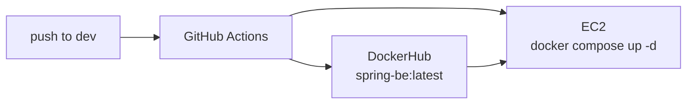

# EmoLetter

하루의 감정을 이모지와 함께 달력에 기록하고, 미래의 나에게 편지를 보내 정해둔 날짜가 되면 받아보는 서비스입니다.

이 저장소는 프론트엔드와 백엔드가 한 리포지터리에 나란히 들어있는 모노리포 구조이며, 이 README는 화면 구성, 코드 구조, API 계약, 로컬 실행 방법을 정리한 개발 핸드북입니다.

> 개발 문서 · 2026.08.23 최종 확인 · 프론트엔드 63개 파일 2,272줄 기준

## 기술 스택

| 영역 | 스택 |
| --- | --- |
| Frontend | React 19, Vite 6, Tailwind CSS 3 |
| Backend | Spring Boot 3.2, Java 21, JPA, Spring Security, JWT |
| Database | MySQL 8, Redis |
| CI/CD | GitHub Actions, DockerHub (EC2 배포 파이프라인, 현재 중단) |

로컬 연동 검증 완료 상태입니다.

## 목차

- [개요](#개요)
- [시스템 구성](#시스템-구성)
- [화면 소개](#화면-소개)
- [기능 상세](#기능-상세)
- [코드 구조](#코드-구조)
- [핵심 코드 해설](#핵심-코드-해설)
- [API 레퍼런스](#api-레퍼런스)
- [백엔드 수정 내역](#백엔드-수정-내역)
- [실행 방법](#실행-방법)
- [알려진 이슈](#알려진-이슈)
- [배포](#배포)

## 개요

EmoLetter는 두 가지 기록을 다룹니다.

- **감정 일기**: 날짜마다 감정 하나와 글을 남기면 달력 칸에 해당 이모지가 표시됩니다.
- **타임캡슐 편지**: 받을 날짜를 지정해 글을 써두면 그 날짜가 지나야 열어볼 수 있습니다.

### 저장소 구조

| 디렉터리 | 내용 | 기술 |
| --- | --- | --- |
| `EmoLetter_FE/` | 웹 프론트엔드. 달력·일기·편지함 UI 전체 | React 19, Vite 6, Tailwind CSS 3 |
| `EmoLetter_BE/` | REST API 서버. 인증·일기·편지 도메인 | Spring Boot 3.2, JPA, Spring Security, JWT |
| `.github/workflows/` | EC2 배포 파이프라인 (현재 중단) | GitHub Actions, DockerHub |

### 도메인 모델

백엔드 엔티티는 세 개이며, `User`가 `Diary`와 `Letter`를 각각 1:N으로 소유합니다.

| 엔티티 | 주요 필드 | 비고 |
| --- | --- | --- |
| `User` | userId(PK, String), email, nickname, password, role, createAt | PK가 숫자가 아니라 사용자가 정한 아이디 문자열입니다. 비밀번호는 BCrypt로 저장합니다. |
| `Diary` | diaryId, content, emojiCode, createAt, user | emojiCode는 자유 문자열 컬럼이라 감정 종류를 프론트에서 늘려도 스키마 변경이 없습니다. |
| `Letter` | letterId, content, noteCode, deliverDate, isDelivered, isOpened, createAt, user | 제목 필드가 없습니다. 목록에서는 본문 앞부분을 잘라 제목처럼 보여줍니다. |
| `RefreshToken` | userId(key), refreshToken | MySQL이 아니라 Redis에 저장됩니다. TTL 24시간입니다. |

**편지의 두 가지 상태 플래그**

`isDelivered`는 "받을 날짜가 지나 열람 가능해졌는가", `isOpened`는 "사용자가 실제로 열어봤는가"를 뜻하는, 서로 다른 개념입니다. `isDelivered`는 백엔드 스케줄러가 매분 갱신하고, `isOpened`는 상세 조회 API가 호출될 때 켜집니다.

## 시스템 구성

로컬 개발 시 요청 경로는 다음과 같습니다. 브라우저는 항상 `5173`만 바라보고, `8080`을 직접 호출하지 않습니다.

```
브라우저 (React SPA)
  └─ fetch('/api/...') + Authorization: Bearer
       └─ Vite dev server (localhost:5173) — /api 프록시
            └─ Spring Boot (localhost:8080)
                 ├─ MySQL · 3306 — 회원 · 일기 · 편지
                 └─ Redis · 6379 — refreshToken
```

### 왜 Vite 프록시를 쓰는가

브라우저가 5173에서 8080을 직접 부르면 다른 오리진이므로 CORS 예비 요청이 필요하고, 로그인 시 백엔드가 내려주는 refreshToken 쿠키가 httpOnly + 크로스 오리진이라 전송 조건이 까다로워집니다. 프록시를 두면 브라우저 입장에서는 전부 같은 오리진이라 이 두 문제가 동시에 사라집니다.

**`EmoLetter_FE/vite.config.js`**

```js
export default defineConfig(({ mode }) => {
  const env = loadEnv(mode, '.', '')
  const backendOrigin = env.VITE_BACKEND_ORIGIN || 'http://localhost:8080'
  return {
    plugins: [react()],
    server: {
      proxy: {
        '/api': { target: backendOrigin, changeOrigin: true },
      },
    },
  }
})
```

프록시를 쓰지 않고 배포 환경처럼 직접 호출하는 경우를 대비해 백엔드에도 CORS 설정을 넣어두었습니다. refreshToken 쿠키를 주고받아야 하므로 `allowCredentials=true`이며, 그 경우 와일드카드 오리진을 쓸 수 없어 주소를 명시했습니다.

**`EmoLetter_BE/.../config/WebSecurityConfig.java`**

```java
configuration.setAllowedOrigins(List.of(
    "http://localhost:5173", "http://127.0.0.1:5173", "http://localhost:3000"));
configuration.setAllowedMethods(List.of("GET","POST","PUT","DELETE","OPTIONS"));
configuration.setAllowCredentials(true);
source.registerCorsConfiguration("/api/**", configuration);
```

## 화면 소개

라우터 라이브러리 대신 `currentView` 상태 하나로 화면을 전환합니다. 상태 값은 `constants/views.js`의 `VIEWS` 상수로 관리하고, 실제 분기는 `ViewRouter`가 담당합니다.

### 랜딩 — `components/landing/Landing.jsx`

앱을 열면 가장 먼저 보이는 전체 화면 인트로입니다. "Diarise & Daydreams" 타이틀과 그라데이션 배경 장식이 있고, 화면 아무 곳이나 클릭하거나 Enter를 누르면 본 화면으로 들어갑니다.

- **진입**: 앱 최초 진입 (`showLanding = true`)
- **나가기**: 클릭 또는 Enter → 달력으로. 한 번 나가면 다시 돌아오지 않습니다.
- **API**: 없음. 순수 정적 화면이며 헤더도 표시되지 않습니다.

### 달력 — `components/calendar/CalendarPage.jsx`

서비스의 홈입니다. 6주 × 7일 = 42칸 그리드로 한 달을 보여주고, 일기를 쓴 날에는 그 날의 감정 이모지가 날짜 아래에 함께 표시됩니다. 오늘 날짜는 그라데이션으로 강조됩니다.

- **진입**: 랜딩 통과 직후, 헤더의 홈 버튼, 글쓰기 화면의 돌아가기
- **구성**: `CalendarNav`(월 이동) · `WeekdayRow`(요일) · `CalendarGrid` → `CalendarCell` × 42
- **상호작용**: 날짜 클릭 → 일기 작성 화면. 단 편지 모드로 진입한 상태면 편지 작성으로 이동
- **API**: `GET /api/diary` — `DiaryContext`가 로그인 시 한 번 불러 날짜별로 색인

### 일기 작성 — `components/diary/DiaryWritePage.jsx`

선택한 날짜의 감정과 글을 기록합니다. 감정 8종을 카드로 고르고 본문을 쓴 뒤 저장합니다. 그 날짜에 이미 일기가 있으면 기존 내용이 채워진 채로 열리고, 저장하면 수정으로 처리됩니다.

- **진입**: 달력에서 날짜 클릭
- **구성**: `BackButton` · `EmotionPicker`(감정 8종) · 본문 textarea · 저장/취소
- **검증**: 감정 선택과 본문이 모두 있어야 저장 버튼이 활성화됩니다.
- **API**: `POST /api/diary` (신규) · `PUT /api/diary/{diaryId}` (수정) → 저장 후 목록 갱신

### 편지 작성 — `components/letter/LetterWritePage.jsx`

미래의 나에게 보낼 편지를 씁니다. 받을 날짜를 고르고 편지지 색을 선택한 뒤 본문을 작성합니다. 날짜 입력에는 `min`이 오늘로 걸려 있어 과거 날짜는 고를 수 없습니다.

- **진입**: 헤더 메뉴 → 편지 보내기. 이후 달력에서 날짜를 눌러도 편지 작성으로 연결됩니다.
- **구성**: 날짜 input · `NotePicker`(편지지 4종) · 본문 textarea
- **완료 후**: 보낸 편지함으로 자동 이동
- **API**: `POST /api/letter`

### 보낸 편지함 — `components/letter/SentLettersPage.jsx`

내가 쓴 편지 전체를 보낸 날짜 최신순으로 보여줍니다. 전체 / 읽은 / 읽지 않은 세 가지로 거를 수 있고, 각 탭에는 실제 건수가 함께 표시됩니다.

- **진입**: 헤더 메뉴 → 보낸 편지함, 또는 편지 발송 완료 직후
- **구성**: `FilterTabs` · `LetterList` → `LetterCard` · `LetterDetailModal`
- **표시**: 아직 받을 날짜가 안 된 편지는 본문 대신 "아직 열어볼 수 없는 편지"로 가려집니다.
- **API**: `GET /api/letter?isOpened=true` + `false` 두 번 호출해 합침

### 받은 편지함 — `components/letter/ReceivedLettersPage.jsx`

보낸 편지 중 받을 날짜가 이미 지난 것만 걸러 보여줍니다. 별도 API가 아니라 같은 편지 목록에서 도착 여부로 필터링한 결과입니다. 편지를 누르면 모달로 전문이 열리고 동시에 읽음 처리됩니다.

- **진입**: 헤더 메뉴 → 받은 편지함
- **필터 기준**: `isDelivered`가 true이거나, `deliverDate`가 현재 시각 이전
- **API**: `GET /api/letter/{letterId}` — 열람 시 호출, 백엔드가 `isOpened`를 켬

### 마이페이지 — `components/mypage/MyPage.jsx`

아이디·이메일·닉네임과 함께 일기 수, 보낸 편지 수, 받은 편지 수를 통계 카드로 보여줍니다. 통계는 별도 API 없이 이미 불러온 컨텍스트 데이터에서 계산합니다.

- **진입**: 헤더 메뉴 → 마이페이지
- **구성**: `ProfileSummary` · `StatCard` × 3 · `NicknameForm`
- **비로그인**: `AuthRequired` 안내 화면으로 대체됩니다.
- **API**: `GET /api/user` · `PUT /api/user/info`

### 로그인 · 회원가입 모달 — `components/auth/LoginModal.jsx`

화면 전환이 아니라 어느 화면에서든 위에 겹쳐 뜨는 모달입니다. 상단 탭으로 로그인과 회원가입을 오가며, 탭을 바꾸면 입력값과 에러가 초기화됩니다. 회원가입에 성공하면 곧바로 로그인까지 이어집니다.

- **진입**: 헤더의 로그인/회원가입 버튼, 또는 보호된 화면의 "로그인하기"
- **구성**: `AuthTabs` · `LoginFields`(2칸) / `SignupFields`(5칸) · `useAuthForm`
- **검증**: 필수값, 이메일 형식, 비밀번호 6자 이상, 비밀번호 확인 일치
- **API**: `POST /api/user` → `POST /api/user/login`

## 기능 상세

### 인증과 세션

로그인에 성공하면 백엔드는 두 개의 토큰을 만듭니다. `accessToken`은 응답 본문에 담겨 오고, `refreshToken`은 httpOnly 쿠키로 내려옵니다. 프론트는 `accessToken`만 `localStorage`에 보관하고 모든 요청에 `Authorization: Bearer`로 붙입니다.

- **세션 복구**: 새로고침하면 `AuthContext`가 저장된 토큰으로 `GET /api/user`를 호출해 사용자 정보를 되살립니다. 실패하면 토큰을 버립니다.
- **복구 중 깜빡임 방지**: `initializing` 상태 동안 헤더는 빈 자리만 잡아두어 로그인 버튼이 잠깐 나타났다 사라지지 않습니다.
- **401 처리**: `http.js`가 401을 받으면 등록된 콜백으로 세션을 정리합니다.
- **로그아웃**: `DELETE /api/user/logout`으로 서버의 refreshToken을 지우고 쿠키를 만료시킵니다. 서버가 실패해도 클라이언트 세션은 반드시 정리합니다.

> **토큰 자동 재발급은 동작하지 않습니다.** `POST /api/token`은 refreshToken을 요청 본문으로 받는데, 정작 그 토큰은 httpOnly 쿠키라 자바스크립트가 읽을 수 없습니다. 그래서 프론트에서 재발급 요청을 만들 방법이 없습니다. 현재는 401이 오면 재발급 대신 세션을 정리하고 다시 로그인을 받습니다. 백엔드가 쿠키에서 토큰을 읽도록 바꾸면 `http.js`에 재시도 로직만 얹으면 됩니다.

### 감정 일기

감정은 `constants/emotions.js`에 8종이 정의돼 있고, `code` 값이 그대로 백엔드 `emojiCode`로 저장됩니다. DB 컬럼이 자유 문자열이라 감정을 추가해도 마이그레이션이 필요 없습니다.

| code | 이모지 | 라벨 | code | 이모지 | 라벨 |
| --- | --- | --- | --- | --- | --- |
| HAPPY | 😊 | 행복 | EXCITED | 🤩 | 신남 |
| SAD | 😢 | 슬픔 | CALM | 😌 | 평온 |
| ANGRY | 😠 | 화남 | LOVE | 🥰 | 사랑 |
| ANXIOUS | 😰 | 불안 | TIRED | 😴 | 피곤 |

백엔드는 "그 날짜의 일기를 찾는" API가 없고 전체 목록만 줍니다. 그래서 프론트가 `createAt`을 `YYYY-MM-DD` 키로 바꿔 객체에 색인해두고, 달력과 작성 화면은 그 색인을 조회합니다. 같은 날짜에 여러 건이 있으면 마지막 것이 남습니다.

**`contexts/DiaryContext.jsx` — 날짜 키 색인과 신규/수정 자동 판별**

```js
// 목록을 'YYYY-MM-DD' → 일기 객체로 색인
setDiaries(list.reduce((acc, diary) => {
  if (!diary.date) return acc;
  acc[toDateKey(diary.date)] = diary;
  return acc;
}, {}));

// 그 날짜에 이미 일기가 있으면 수정, 없으면 생성
const existing = diaries[toDateKey(date)];
if (existing?.id) {
  await diaryApi.updateDiary(existing.id, { date, emotion, content });
} else {
  await diaryApi.createDiary({ date, emotion, content });
}
await refresh();
```

### 타임캡슐 편지

편지 목록 API는 `isOpened` 파라미터가 필수라 "전체"를 한 번에 받을 수 없습니다. 그래서 `true`와 `false`로 두 번 호출한 뒤 합쳐서 보낸 날짜 최신순으로 정렬합니다.

**`api/letterApi.js`**

```js
export const fetchAllLetters = async () => {
  const [opened, unopened] = await Promise.all([
    api.get('/letter', { params: { isOpened: true } }),
    api.get('/letter', { params: { isOpened: false } }),
  ]);
  return [...(opened || []), ...(unopened || [])]
    .map(toLetter)
    .sort((a, b) => (b.sentDate?.getTime() || 0) - (a.sentDate?.getTime() || 0));
};
```

받은 편지함은 별도 엔드포인트가 아니라 이 목록에서 도착한 것만 거른 결과입니다. 도착 판정은 백엔드 스케줄러의 `isDelivered`를 우선 보되, 아직 반영되지 않았어도 받을 날짜가 지났으면 도착한 것으로 취급합니다. 스케줄러가 1분에 한 번 도니 그 사이 공백을 메우기 위한 것입니다.

**`utils/letter.js`**

```js
export const isArrived = (letter) =>
  Boolean(letter.isDelivered) ||
  (letter.deliverDate ? new Date(letter.deliverDate).getTime() <= Date.now() : false);
```

편지를 누르면 `useLetterReader`가 도착 여부를 먼저 확인합니다. 아직이면 열지 않고 "아직 받을 날짜가 되지 않은 편지예요"를 띄우고, 도착했으면 상세 조회를 호출합니다. 이 호출 자체가 백엔드에서 읽음 처리를 겸합니다.

**편지지**: `noteCode`에 저장되며 `PINK`, `PURPLE`, `MINT`, `CREAM` 네 종류입니다. 카드 좌측 색 블록과 모달 상단 띠에 반영됩니다. 알 수 없는 코드가 오면 기본값 `PINK`로 대체합니다.

## 코드 구조

### 단 하나의 규칙

컴포넌트는 서버를 직접 부르지 않습니다. 데이터는 항상 **컴포넌트 → 컨텍스트 → API 모듈 → http.js** 순으로만 내려갑니다. 이 규칙 덕분에 엔드포인트가 바뀌어도 컴포넌트를 건드릴 일이 없고, 컴포넌트는 순수하게 화면 조립만 담당합니다.

| 레이어 | 책임 | 해서는 안 되는 일 |
| --- | --- | --- |
| `components/` | 화면 조립, 입력 검증, 로컬 UI 상태 | fetch 직접 호출 |
| `contexts/` | 전역 상태 보관, API 호출 시점 결정, 로딩·에러 상태 | Tailwind 클래스, JSX 마크업 |
| `api/` | 엔드포인트 경로, 요청 본문 조립, 응답을 프론트 모델로 변환 | React 훅 사용 |
| `utils/` · `constants/` | 날짜 포맷, 도착 판정, 감정·편지지 코드표 | 상태 보유 |

### 파일 배치

전체 63개 파일, 총 2,272줄입니다. 가장 큰 파일이 121줄(`http.js`)이라 어느 파일이든 한 화면 안에서 다 읽힙니다.

```
src/
├─ App.jsx                  16   프로바이더 3중첩만
├─ api/
│  ├─ http.js                121   fetch 래퍼 · 토큰 · 에러 변환
│  ├─ authApi.js             34
│  ├─ diaryApi.js            36
│  └─ letterApi.js           48
├─ contexts/
│  ├─ AuthContext.jsx        102   로그인 · 세션 복구 · 401 처리
│  ├─ DiaryContext.jsx        81   날짜 키 색인
│  └─ LetterContext.jsx       83   보낸/받은 편지 파생
├─ hooks/
│  ├─ useAppNavigation.js     56   화면 전환 상태 기계
│  ├─ useLetterReader.js      38   편지 열람 + 모달
│  └─ useClickOutside.js      17
├─ utils/                     date.js 44 · letter.js 8
├─ constants/                 emotions.js 24 · notes.js 15 · views.js 15
└─ components/
   ├─ common/     Button · Card · Modal · TextField · FilterTabs
   │              PageHeader · StatusMessage · AuthRequired
   │              BackButton · GradientHeading · icons/
   ├─ layout/     AppLayout · Header · HeaderMenu · HomeButton
   │              AuthActions · ViewRouter
   ├─ landing/    Landing
   ├─ calendar/   CalendarPage · CalendarNav · CalendarGrid
   │              CalendarCell · WeekdayRow · buildCalendarDays.js
   ├─ diary/      DiaryWritePage · EmotionPicker
   ├─ letter/     LetterWritePage · SentLettersPage · ReceivedLettersPage
   │              LetterList · LetterCard · LetterStatusBadge
   │              LetterDetailModal · NotePicker
   ├─ auth/       LoginModal · AuthTabs · LoginFields · SignupFields
   │              useAuthForm.js · authValidation.js
   └─ mypage/     MyPage · ProfileSummary · StatCard · NicknameForm
```

### 공용 컴포넌트

반복되던 Tailwind 클래스 덩어리를 `common/`으로 모았습니다. 여러 화면이 같은 컴포넌트를 쓰기 때문에 버튼 하나만 고쳐도 전체에 반영됩니다.

| 컴포넌트 | 역할 | 주요 props | 쓰이는 곳 |
| --- | --- | --- | --- |
| `Button` | 그라데이션 버튼 | variant(pink·purple·gradient·neutral), size, disabled | 거의 전 화면 |
| `Card` | 반투명 흰 패널 | className | 달력·작성·마이페이지 |
| `Modal` | 배경 클릭 시 닫히는 오버레이 | isOpen, onClose | 로그인, 편지 상세 |
| `TextField` | 라벨·에러 포함 입력 | label, error, tone | 로그인·회원가입·닉네임 |
| `FilterTabs` | 건수 뱃지 달린 탭 | options[{value,label,count}], tone | 보낸·받은 편지함 |
| `StatusMessage` | 로딩·빈 상태·에러 3종 | onRetry | 목록·폼 전반 |
| `AuthRequired` | 로그인 필요 안내 | message, onLoginClick | 보호된 화면 |
| `PageHeader` | 제목 + 부제 | title, subtitle | 편지함·마이페이지 |

## 핵심 코드 해설

읽을 때 헷갈리기 쉬운 네 곳을 정리했습니다.

### `http.js` — 모든 요청이 지나는 길목

토큰 부착, 쿠키 동봉, 에러 메시지 변환, 401 감지를 한곳에서 처리합니다. 각 API 모듈은 경로와 본문만 신경 쓰면 됩니다.

- **토큰 보관**: 메모리 캐시 + localStorage 이중. 매 요청마다 스토리지를 읽지 않습니다.
- **`credentials: 'include'`**: refreshToken 쿠키가 함께 전송되도록 모든 요청에 붙입니다.
- **에러 변환**: 상태 코드별 한국어 기본 문구를 두고, 서버가 `message`나 `errors`를 주면 그쪽을 우선합니다. 네트워크 자체가 실패하면 `status 0`으로 "서버에 연결할 수 없습니다"를 냅니다.
- **401 콜백**: `AuthContext`가 등록한 핸들러를 호출해 세션을 정리합니다. 순환 참조를 피하려고 컨텍스트를 직접 import하지 않고 콜백을 주입받는 구조입니다.

**`api/http.js` — 요청 본체**

```js
export const request = async (path, { method='GET', body, params, auth=true } = {}) => {
  const headers = {};
  if (body !== undefined) headers['Content-Type'] = 'application/json';
  const token = getAccessToken();
  if (auth && token) headers.Authorization = `Bearer ${token}`;

  let response;
  try {
    response = await fetch(buildUrl(path, params), {
      method, headers,
      credentials: 'include',
      body: body === undefined ? undefined : JSON.stringify(body),
    });
  } catch (cause) {
    throw new ApiError('서버에 연결할 수 없습니다…', 0, cause);
  }

  const payload = await parseBody(response);
  if (!response.ok) {
    if (response.status === 401 && unauthorizedHandler) unauthorizedHandler();
    throw new ApiError(extractMessage(payload, response.status), response.status, payload);
  }
  return payload;
};
```

### `date.js` — `toISOString`을 쓰면 안 되는 이유

백엔드는 `LocalDateTime`을 씁니다. 타임존이 없는 "벽시계 시각"입니다. 그런데 `toISOString()`은 값을 UTC로 바꿔버립니다. 한국 시간 기준으로 8월 22일 새벽 2시는 UTC로 8월 21일 17시가 되어, 저장된 일기의 날짜가 하루 밀립니다. 그래서 문자열을 직접 조립합니다.

**`utils/date.js`**

```js
// 'YYYY-MM-DDTHH:mm:ss' — 타임존 변환 없이 로컬 시각 그대로
export const toLocalDateTimeString = (date) => {
  const d = new Date(date);
  const pad = (n) => String(n).padStart(2, '0');
  return `${d.getFullYear()}-${pad(d.getMonth()+1)}-${pad(d.getDate())}`
       + `T${pad(d.getHours())}:${pad(d.getMinutes())}:${pad(d.getSeconds())}`;
};
```

### `useAppNavigation` — `writeMode`가 필요한 이유

달력에서 날짜를 누르면 보통 일기 작성으로 갑니다. 그런데 사용자가 메뉴에서 "편지 보내기"를 고른 뒤에는 같은 클릭이 편지 작성으로 가야 합니다. 이 "지금 어느 모드인가"를 `writeMode`가 기억합니다.

**`hooks/useAppNavigation.js`**

```js
const selectDate = useCallback((date) => {
  setSelectedDate(date);
  setCurrentView(writeMode === 'letter' ? VIEWS.LETTER_WRITE : VIEWS.DIARY_WRITE);
}, [writeMode]);

const selectMenu = useCallback((view) => {
  setSelectedDate(null);
  setCurrentView(view);
  setWriteMode(view === VIEWS.LETTER_WRITE ? 'letter' : 'diary');
}, []);
```

### `ViewRouter` — 화면 보호

일기 작성, 편지 작성, 두 편지함은 로그인이 필요합니다. 각 컴포넌트마다 검사하지 않고 라우터 한곳에서 목록으로 관리합니다.

**`components/layout/ViewRouter.jsx`**

```jsx
const PROTECTED_VIEWS = [
  VIEWS.DIARY_WRITE, VIEWS.LETTER_WRITE, VIEWS.SENT, VIEWS.RECEIVED,
];

if (PROTECTED_VIEWS.includes(currentView) && !isAuthenticated) {
  return <AuthRequired onLoginClick={onLoginClick} />;
}
```

### 응답 정규화

백엔드 DTO를 그대로 쓰지 않고 `toDiary`, `toLetter`, `toUser`로 한 번 변환합니다. `nickName`처럼 대소문자가 다른 필드, 날짜 문자열을 `Date`로 바꾸는 작업, 그리고 Lombok 게터 때문에 `isOpened`가 `opened`로 직렬화될 수 있는 상황을 이 지점에서 흡수합니다. 덕분에 컴포넌트는 항상 같은 모양의 객체만 봅니다.

## API 레퍼런스

모든 경로는 `/api`로 시작합니다. 인증이 필요한 요청에는 `Authorization: Bearer <accessToken>` 헤더가 붙습니다.

### 인증 · 회원

| 메서드 | 경로 | 설명 | 인증 | 프론트 |
| --- | --- | --- | --- | --- |
| POST | `/api/user` | 회원가입 | 공개 | 사용 |
| POST | `/api/user/login` | 로그인. accessToken 반환 + refreshToken 쿠키 | 공개 | 사용 |
| DELETE | `/api/user/logout` | refreshToken 삭제 및 쿠키 만료 | 공개 | 사용 |
| GET | `/api/user` | 내 정보 조회 | 🔒 필요 | 사용 |
| PUT | `/api/user/info` | 닉네임 수정 | 🔒 필요 | 사용 |
| PUT | `/api/user/info/password` | 비밀번호 변경 | 🔒 필요 | 미사용 |
| DELETE | `/api/user` | 회원 탈퇴 | 🔒 필요 | 미사용 |
| POST | `/api/token` | accessToken 재발급 | 공개 | 미사용 |
| GET | `/api/health` | 헬스체크 | 공개 | 미사용 |

### 일기

| 메서드 | 경로 | 설명 | 인증 | 프론트 |
| --- | --- | --- | --- | --- |
| POST | `/api/diary` | 일기 작성. 201 반환 | 🔒 필요 | 사용 |
| GET | `/api/diary` | 내 일기 전체 조회 | 🔒 필요 | 사용 |
| PUT | `/api/diary/{diaryId}` | 일기 수정 | 🔒 필요 | 사용 |
| GET | `/api/diary/{diaryId}` | 일기 단건 조회 | 🔒 필요 | 미사용 |
| DELETE | `/api/diary/{diaryId}` | 일기 삭제 | 🔒 필요 | 준비됨 |

### 편지

| 메서드 | 경로 | 설명 | 인증 | 프론트 |
| --- | --- | --- | --- | --- |
| POST | `/api/letter` | 편지 작성. 201 반환 | 🔒 필요 | 사용 |
| GET | `/api/letter?isOpened=` | 내 편지 목록. 파라미터 필수 | 🔒 필요 | 사용 |
| GET | `/api/letter/{letterId}` | 상세 조회 + 읽음 처리 | 🔒 필요 | 사용 |
| GET | `/api/letter/notification` | 도착했지만 안 읽은 편지 | 🔒 필요 | 준비됨 |
| PUT | `/api/letter/{letterId}` | 편지 수정 | 🔒 필요 | 미사용 |
| DELETE | `/api/letter/{letterId}` | 편지 삭제 | 🔒 필요 | 준비됨 |

### 요청 · 응답 예시

**`POST /api/user/login` — 요청**

```json
{ "userId": "testuser1", "password": "test1234" }
```

**`POST /api/user/login` — 응답 200** (+ `Set-Cookie: refreshToken`)

```json
{
  "userId": "testuser1",
  "nickName": "테스트유저",
  "role": "ROLE_USER",
  "email": "testuser1@example.com",
  "createAt": "2026-08-22T02:31:05",
  "accessToken": "eyJhbGciOiJIUzI1NiJ9…"
}
```

> `nickName`은 N이 대문자입니다. `toUser`에서 `nickname`으로 변환합니다.

**`POST /api/diary` — 요청**

```json
{
  "content": "연동 테스트 일기입니다.",
  "emojiCode": "HAPPY",
  "createAt": "2026-08-15T00:00:00"
}
```

> `createAt`은 타임존 없는 `LocalDateTime` 문자열입니다.

**`GET /api/diary` — 응답 200**

```json
[
  {
    "diaryId": 1,
    "content": "연동 테스트 일기입니다.",
    "createAt": "2026-08-15T00:00:00",
    "nickname": "테스트유저",
    "emojiCode": "HAPPY"
  }
]
```

**`POST /api/letter` — 요청**

```json
{
  "content": "미래의 나에게. 잘 지내고 있니?",
  "noteCode": "PINK",
  "deliverDate": "2026-12-25T00:00:00"
}
```

**`GET /api/letter/3` — 응답 200** (호출과 동시에 `isOpened`가 `true`로 바뀝니다)

```json
{
  "letterId": 3,
  "content": "미래의 나에게. 잘 지내고 있니?",
  "deliverDate": "2026-08-22T00:00:00",
  "isOpened": true,
  "isDelivered": true,
  "createAt": "2026-08-22T02:33:10",
  "noteCode": "PINK",
  "nickname": "테스트유저"
}
```

**boolean 필드 이름 주의**: Lombok `@Getter`가 `private boolean isOpened`에 대해 `isOpened()`를 만들면 Jackson은 `is`를 떼고 `opened`로 직렬화합니다. 그래서 DTO에 `@JsonProperty("isOpened")`를 명시해 이름을 고정했고, 프론트 `toLetter`도 `response.isOpened ?? response.opened`로 양쪽을 모두 받습니다.

## 백엔드 수정 내역

프론트 연동 과정에서 발견해 고친 것들입니다.

| 대상 | 문제 | 조치 |
| --- | --- | --- |
| `DiaryService.save` | 빌더가 `createAt`을 null로 덮어써 NOT NULL 위반. 일기 저장이 항상 실패했음 | 요청값이 없으면 현재 시각으로 채우도록 수정 |
| `DiaryService.findByUserId` | 이름과 달리 `findAll()`을 반환해 다른 사용자의 일기까지 내려갔음 | `findByUser_UserId(userId)` 결과를 반환 |
| `LetterService` · `LetterController` | 편지 목록과 상세가 사용자 구분 없이 조회됨 | Principal 기준으로 범위 제한. 저장소에 사용자 한정 메서드 추가 |
| `DiaryResponse` · `LetterResponse` | 응답에 `diaryId`, `letterId`가 없어 프론트가 수정·열람을 호출할 수 없었음 | id 노출. `LetterResponse`에 `isDelivered`도 추가하고 직렬화 이름 고정 |
| `WebSecurityConfig` | CORS 설정이 없어 프록시 없이는 프론트가 호출할 수 없었음 | `CorsConfigurationSource` 빈 추가 |

### 연동 검증 결과

실제 서버를 띄우고 브라우저로 전 과정을 확인했습니다.

| 동작 | 요청 | 결과 |
| --- | --- | --- |
| 회원가입 | POST /api/user | 200 |
| 자동 로그인 | POST /api/user/login | 200, Redis 저장 정상 |
| 일기 저장 | POST /api/diary | 201 |
| 달력 반영 | GET /api/diary | 이모지 표시 |
| 편지 발송 | POST /api/letter | 201 |
| 편지 열람 | GET /api/letter/3 | 200, 읽음 전환 확인 |
| 마이페이지 | GET /api/user | 통계 1/1/1 |
| 닉네임 변경 | PUT /api/user/info | 200 |
| 비밀번호 변경 | PUT /api/user/info/password | 200 / 틀리면 400 + 사유 |
| 편지 수정 | PUT /api/letter/{id} | 200, 남의 편지는 거부 |
| 편지 삭제 | DELETE /api/letter/{id} | 200, 남의 편지는 거부 |
| 회원 탈퇴 | DELETE /api/user | 200, 일기·편지까지 함께 삭제 |

## 실행 방법

Docker 없이 로컬에서 띄우는 순서입니다.

### 1. MySQL 확인

윈도우에 설치된 MySQL이 3306에서 실행 중이어야 합니다. `.env`의 `DATABASE_DB` 이름으로 된 데이터베이스가 있어야 하며, 테이블은 `ddl-auto: update`가 첫 실행에 만듭니다.

### 2. Redis 실행

WSL 안에 설치돼 있습니다. **한 번만** systemd 서비스로 등록해두면 이후로는 신경 쓰지 않아도 됩니다.
`wsl -u root`는 비밀번호 없이 들어가므로 sudo 암호가 필요 없습니다.

```bash
wsl -u root -- systemctl enable --now redis-server
```

`wsl redis-cli ping`이 `PONG`을 내면 성공입니다.
`run-local.ps1`은 6379가 죽어 있으면 WSL을 깨우고, 서버가 도는 동안 VM이 잠들지 않게 붙잡아 둡니다.
자세한 내용은 [알려진 이슈](#알려진-이슈)의 WSL 항목을 참고하세요.

### 3. 백엔드 기동

IntelliJ 실행 구성에서 `EmoLetter BE (local)`를 고릅니다. Dockerfile 구성을 고르면 "Server Docker not found"가 뜹니다. 터미널을 선호하면 `EmoLetter_BE/run-local.ps1`이 `.env`를 읽어 그대로 띄웁니다.

### 4. 프론트엔드 기동

```bash
cd EmoLetter_FE
npm install
npm run dev        # http://localhost:5173
```

> **환경변수는 자동으로 읽히지 않습니다.** `build.gradle`에 dotenv 의존성이 없어 스프링은 `.env`를 스스로 읽지 못합니다. 그동안은 Docker의 `env_file`이 대신 넣어주고 있었습니다. IntelliJ 실행 구성은 `envFilePaths`로 `.env`를 직접 읽도록 설정해두었고, `run-local.ps1`은 CRLF까지 처리해 환경변수로 주입합니다.

## 알려진 이슈

### 해결됨 (2026.08.27)

| 항목 | 조치 |
|---|---|
| 배포 자동 트리거 | `workflow_dispatch`로 변경. push해도 배포가 돌지 않는다 |
| 토큰 재발급 불가 | 백엔드가 쿠키에서 refreshToken을 읽고, 프런트는 401에 재발급 후 원래 요청 재시도 |
| 인증 실패 시 403 반환 | `HttpStatusEntryPoint(401)` 지정. 재발급이 동작하려면 401이어야 했다 |
| 서버 오류가 401로 둔갑 | `/error`를 permitAll. 진짜 원인(500)이 그대로 보인다 |
| 편지 제목 없음 | `title` 컬럼 추가(nullable). 제목 없는 옛 편지는 본문 발췌로 대체 |
| 일기 소유자 검사 | 단건 조회·수정·삭제를 `findOwnedDiary`로 통일 |
| Redis 설정 무효 | `spring.data.redis`로 이동 + compose에 `REDIS_HOST: redis` |
| 장애 원인이 안 보임 | `@RestControllerAdvice`로 사용자 응답과 개발자 로그 분리. Redis·DB 장애는 503 |
| 로그인 실패 문구가 막연함 | `InvalidCredentialsException` 추가. 401 + "아이디 또는 비밀번호가 올바르지 않습니다" |
| WSL Redis 끊김 | `run-local.ps1`이 WSL을 깨우고 세션 동안 붙잡아 둔다 |

### 해결됨 (2026.09.03)

| 항목 | 조치 |
|---|---|
| MySQL 호스트 하드코딩 | `.env`에 없는 새 이름 `MYSQL_HOST`를 사용. 로컬은 기본값 `localhost`, 도커는 compose가 `mysql`로 덮어쓴다 |
| 편지 수정·삭제 소유자 검사 | `findOwnedLetter` 하나로 통일. 남의 편지 번호를 넣으면 없는 편지와 동일하게 취급된다 |
| 편지 저장 응답에 사용자 정보 노출 | 엔티티 대신 `LetterResponse` 반환. password 해시가 응답에 실리지 않는다 |
| 편지 수정 시 작성 시각 유실 | `Letter.update()`에서 `createAt` 제거. 작성 시각은 수정 대상이 아니다 |
| 미사용 API | 비밀번호 변경·회원 탈퇴는 마이페이지에, 편지 수정은 보낸 편지함에 화면 추가 |
| 탈퇴 시 FK 제약 위반 | 자식(편지·일기) → 부모(계정) 순서로 삭제. Redis의 refreshToken 사본과 쿠키도 함께 정리 |
| 비밀번호 오류가 로그아웃 유발 | 401 → 400. 인증 실패와 입력값 오류를 상태 코드로 분리 |
| 잘못된 요청 본문이 500 | `HttpMessageNotReadableException`을 400으로 처리 |

> [!NOTE]
> **도착한 편지는 수정할 수 없다.**
> 과거의 내가 쓴 글을 지금의 내가 고쳐 쓰면 타임캡슐이라는 전제가 무너지기 때문이다.
> 서버가 막고(`400 "이미 도착한 편지는 수정할 수 없어요."`), 화면은 미도착 편지에만
> 「고쳐 쓰기」 버튼을 노출한다.

### 남아 있는 것

| 항목 | 내용 | 해결 방향 |
|---|---|---|
| 남은 테스트 계정 | 로컬 DB에 `testuser1`(일기 1·편지 2), `test01`(편지 1)이 남아 있다 | 마이페이지의 회원 탈퇴로 정리하거나 SQL로 직접 삭제 |
| refreshToken 회전 없음 | 재발급 시 accessToken만 갱신한다. 24시간 뒤에는 다시 로그인해야 한다 | 재발급 때 refreshToken도 함께 새로 발급(rotation) |
| 로그아웃 즉시 차단 불가 | 발급된 accessToken은 서버가 회수할 수 없다. 유출 시 최대 1시간 유효 | Redis 블랙리스트. 매 요청 Redis 조회가 생기는 비용이 있다 |
| 배포 파이프라인 중단 | EC2/DockerHub 배포가 끊겨 트리거를 `workflow_dispatch`로 막아두었다 | 인프라 복구 시 트리거 복원 (방법은 워크플로 주석에 있다) |

> [!TIP]
> **WSL Redis가 자꾸 끊기는 문제는 `run-local.ps1`이 처리한다.**
> WSL2는 1분쯤 놀면 가상머신을 통째로 내리고, 그 안의 Redis도 함께 사라진다.
> 스크립트는 기동 전에 WSL을 깨우고, 서버가 도는 동안 WSL 안에 프로세스를 하나 띄워
> VM을 붙잡아 둔다(종료 시 자동 정리, 최대 8시간). 전역 설정은 건드리지 않는다.
> 사전에 한 번만 서비스 등록을 해두면 된다:
> `wsl -u root -- systemctl enable --now redis-server`

## 배포

> [!IMPORTANT]
> **배포는 현재 일시 중단 상태다.** 트리거가 `workflow_dispatch`로 바뀌어 있어
> `dev`에 push해도 자동 배포가 돌지 않는다. Actions 탭에서 수동 실행할 때만 동작한다.
> 되돌리는 방법은 워크플로 파일 주석에 적어두었다.

원래 배포 흐름은 다음과 같다.



1. JDK 21 세팅 → DockerHub 로그인
2. `EmoLetter_BE/Dockerfile`로 이미지 빌드 및 push
3. `docker-compose.yml`을 EC2의 `~/app/`으로 전송
4. EC2에서 `.env` 기록 → 기존 컨테이너 제거 → 최신 이미지 pull → `docker compose up -d`

필요한 GitHub Secrets: `DOCKERHUB_USERNAME` `DOCKERHUB_TOKEN` `EC2_HOST` `EC2_USER` `EC2_SSH_KEY` `SPRING_ENV_FILE`

> [!NOTE]
> `docker-compose.yml`의 `spring-be`는 `image:`로 DockerHub 이미지를 받아온다.
> 로컬 코드로 컨테이너를 띄우려면 `build: .`로 바꿔야 한다.
> 자세한 내용은 [EmoLetter_BE/DEPLOY.md](EmoLetter_BE/DEPLOY.md) 참고.

---

EmoLetter · 프론트엔드 컴포넌트 분리와 백엔드 연동 기준 · 최종 확인 2026년 9월 3일

상세 문서: [개발 핸드북](docs/emoletter-handbook.html) · [JWT 필터 체인 해부](docs/jwt-filter-chain.html)
